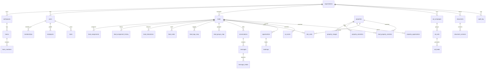

# Database Design: Pikorua CRM

## Purpose and scope
This document defines a production-grade, secure, and scalable database design for the Pikorua Realty CRM. It covers all current features and all planned features implied by the UI routes (AI control, bookings, documents, employees, HNI clients, leads, Meta ads, properties, reports, scripts, settings, site visits, smart matching, and WhatsApp).

## Goals
- Security first: tenant isolation, field-level encryption for PII, full auditability
- Scalability: high-volume messaging and activity tracking, fast lead workflows
- Extensibility: supports new channels, property types, and AI features
- Compliance: data retention, consent tracking, and least-privilege access

## Recommended stack
- Primary OLTP: PostgreSQL 16
- Extensions: pgcrypto (hashing), citext (case-insensitive), pg_trgm (search), pgvector (AI embeddings), postgis (optional geo)
- Cache and queues: Redis
- Documents and media: object storage (S3 compatible) with signed URLs
- Analytics: optional columnar store (ClickHouse or BigQuery) for heavy reporting

## Multi-tenant model
- Tenant is an organization; all data is scoped by `tenant_id`.
- Every business table includes `tenant_id`, `created_at`, `updated_at`, and `deleted_at` (soft delete).
- PostgreSQL Row Level Security (RLS) enforces tenant isolation and role-based access.

## Security model
- Identity and access controls:
  - Roles and permissions for fine-grained access
  - Team scopes for lead visibility (team or branch level)
  - API keys and service accounts for integrations
- PII protection:
  - Application-layer encryption for names, phone, email, addresses
  - Deterministic hash columns for search and dedupe (example: `phone_hash`)
  - Data masking for non-privileged roles
- Auditability:
  - Immutable audit logs for create, update, delete
  - Optional read access logs for HNI data
- Backups:
  - Encrypted backups with PITR, cross-region replication

## Core entity model (ER diagram)

## Domain schemas and key tables

### 1) Identity, access, and tenancy
- `organizations` (tenant root)
  - `id`, `name`, `status`, `billing_plan`, `timezone`, `locale`
- `workspaces` (branch or business unit)
  - `id`, `tenant_id`, `name`, `region`, `status`
- `users` (auth identity)
  - `id`, `tenant_id`, `email_encrypted`, `email_hash`, `status`, `last_login_at`
- `memberships` (user to organization and workspace)
  - `user_id`, `tenant_id`, `workspace_id`, `role_id`, `status`
- `roles`, `permissions`, `role_permissions`, `user_roles`
- `teams`, `team_members`
- `service_accounts`, `api_keys`

### 2) People, companies, and HNI profiles
- `persons` (normalized contact identity)
  - `id`, `tenant_id`, `name_encrypted`, `phone_encrypted`, `phone_hash`, `email_encrypted`, `email_hash`
- `accounts` (companies)
  - `id`, `tenant_id`, `name`, `industry`, `size`
- `person_addresses`, `person_documents` (optional)
- `client_profiles`
  - `person_id`, `tier` (silver, gold, platinum), `portfolio_value`, `since_year`, `preferences` (JSONB)

### 3) Employees and performance
- `employees` (user profile)
  - `user_id`, `employee_code`, `role`, `phone_encrypted`, `status`
- `employee_goals` (daily, weekly, monthly)
- `employee_activities` (calls, meetings, site visits, etc.)
- `performance_snapshots` (periodic metrics)

### 4) Leads and pipeline
- `leads`
  - `id`, `tenant_id`, `person_id`, `status`, `source`, `owner_user_id`, `project_category`
  - `ai_score`, `whatsapp_status`, `created_at`, `last_interaction_at`
- `lead_preferences`
  - `lead_id`, `budget_min`, `budget_max`, `property_types`, `location`, `preferred_sqft_min`, `preferred_sqft_max`
- `lead_tags`, `lead_tags_map`
- `lead_groups`, `lead_groups_map`
- `lead_notes`
- `lead_interactions`
  - `type` (call, whatsapp, email, meeting, site_visit, assignment, note)
  - `outcome`, `duration_seconds`, `metadata` (JSONB)
- `lead_assignments` (current owner)
- `lead_assignment_history`
- `lead_stage_history` (for reports and compliance)

### 5) Properties and listings
- `properties`
  - `id`, `tenant_id`, `name`, `type`, `location`, `area`, `price`, `sqft`, `status`, `developer`
- `property_images` (object storage key, order)
- `property_amenities` (normalized)
- `property_appreciation` (historical and projected data)
- `property_inventory` (if multiple units per project)

### 6) Site visits and appointments
- `appointments`
  - `id`, `tenant_id`, `lead_id`, `property_id`, `employee_id`, `scheduled_at`, `status`, `feedback`, `rating`
- `appointment_reminders` (queued notifications)

### 7) Opportunities, bookings, and revenue
- `opportunities` (deal pipeline)
  - `id`, `tenant_id`, `lead_id`, `property_id`, `stage`, `amount`, `expected_close_date`
- `bookings` (confirmed or pending)
  - `id`, `tenant_id`, `opportunity_id`, `amount`, `commission`, `status`
- `payments` (optional for deal tracking)

### 8) Communications (WhatsApp, email, calls)
- `conversations`
  - `id`, `tenant_id`, `lead_id`, `channel` (whatsapp, email, call, sms)
- `messages`
  - `id`, `conversation_id`, `direction`, `content_encrypted`, `status`, `sent_at`, `received_at`
- `message_media`
  - `id`, `message_id`, `media_type`, `storage_key`, `size_bytes`, `checksum`
- `message_ai_analysis`
  - `message_id`, `intent`, `urgency`, `sentiment`, `suggested_action`
- `conversation_insights`
  - `conversation_id`, `current_sentiment`, `trend`, `confidence`, `risk_factors`, `opportunities`

### 9) Marketing and Meta ads
- `ad_accounts`
- `ad_campaigns`
- `ad_sets`
- `ad_creatives`
- `ad_leads` (raw leads from campaigns)
  - `ad_lead_id`, `form_data` (JSONB), `received_at`, `status`, `assigned_to`
- `utm_attribution` (for lead source tracking)

### 10) Scripts and knowledge base
- `scripts`
  - `id`, `tenant_id`, `title`, `category`, `content`, `tags`
- `script_versions`
- `script_usage` (for analytics)

### 11) Documents and compliance
- `documents`
  - `id`, `tenant_id`, `entity_type`, `entity_id`, `storage_key`, `document_type`, `status`
- `document_versions`
- `document_permissions`
- `signature_requests` (if using e-sign)

### 12) AI control and smart matching
- `ai_models` (model registry)
  - `name`, `provider`, `version`, `status`, `cost_policy`
- `ai_prompts` (prompt templates)
- `ai_policies` (guardrails and safety filters)
- `ai_jobs` (async inference jobs)
- `ai_results` (model outputs)
- `lead_property_matches`
  - `lead_id`, `property_id`, `score`, `explanations` (JSONB)

### 13) Tasks, reminders, and notifications
- `tasks`
  - `id`, `tenant_id`, `user_id`, `title`, `due_at`, `status`, `priority`
- `reminders`
- `notifications` (in-app and email)

### 14) Reporting and audit
- `audit_log` (write operations)
  - `id`, `tenant_id`, `actor_id`, `entity_type`, `entity_id`, `action`, `diff`
- `event_log` (product analytics)
- `daily_metrics`, `pipeline_snapshots` (materialized views or ETL)

### 15) Settings and configuration
- `settings` (per tenant)
- `custom_fields` (for leads, properties, deals)
- `pipeline_stages`
- `feature_flags`

## Enumerations and lookup tables
Use small lookup tables instead of hard-coded enums for extensibility:
- `lead_status`, `lead_source`, `lead_tag`
- `property_type`, `property_status`
- `conversation_channel`, `message_status`
- `opportunity_stage`, `booking_status`
- `task_priority`, `reminder_status`, `appointment_status`

## Indexing strategy
- Leads and pipeline:
  - `leads (tenant_id, status, created_at)`
  - `leads (tenant_id, owner_user_id, status)`
  - `leads (tenant_id, phone_hash)` unique
- Messaging:
  - `messages (conversation_id, sent_at)`
  - `messages (tenant_id, lead_id, sent_at)` via join index or covering index
- Properties:
  - `properties (tenant_id, status, price)`
  - `properties (tenant_id, location, type)`
- Ads:
  - `ad_leads (tenant_id, received_at)`
- Reporting:
  - `lead_interactions (tenant_id, timestamp)`
  - `site_visits (tenant_id, scheduled_at)`

## Partitioning strategy
- Time-based partitions for high-volume tables:
  - `messages`, `lead_interactions`, `audit_log`, `event_log`
- Optional tenant partitioning for very large tenants:
  - `leads`, `opportunities`, `properties`

## Data lifecycle and retention
- Soft delete with `deleted_at` for recovery
- Configurable retention for messages and audit logs
- Legal hold flags for compliance
- Scheduled anonymization for closed or lost leads after retention period

## Encryption and secrets handling
- Use envelope encryption per tenant for PII data
- Store only hashed values for search and dedupe
- Keep keys in KMS (AWS KMS, GCP KMS, or Azure Key Vault)
- Tokenize sensitive fields for restricted roles

## Consistency and auditability
- All writes go through an audit layer
- Use a transactional outbox (`outbox_events`) to notify integrations
- Idempotency keys for inbound webhooks and API writes

## Migration and evolution
- Use a versioned migration tool (Prisma, Drizzle, or Flyway)
- Additive schema changes by default
- Backfill jobs for large migrations
- Feature flags for staged rollout

## Operational readiness checklist
- RLS enabled for all tenant tables
- PITR backups and DR drills
- Slow query monitoring and index reviews
- Data quality checks (duplicate leads, invalid phones)
- Document storage lifecycle policies

## Future-ready extensions
- CRM automation rules engine
- Omnichannel support (SMS, email, voice)
- Advanced pricing and offer workflows
- AI copilot for lead summaries and next-best-action
